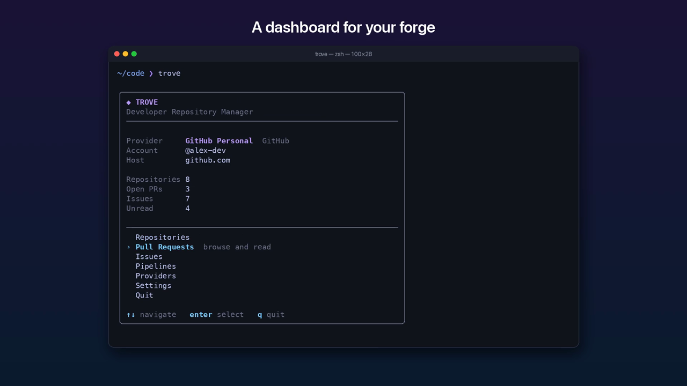

# Trove

**One CLI for GitHub, GitLab, Bitbucket and your own forge.**

Trove manages repositories, pull/merge requests, issues, CI pipelines, releases,
snippets, keys and more across every Git forge you use, from one consistent
command line and terminal UI. Credentials live in a real secret store
(Bitwarden, macOS Keychain, Linux Secret Service), never in the configuration
file.

```sh
trove repo list --all-providers              # every repository on every account
trove repo clone --all --namespace my-org    # bulk clone with bounded concurrency
trove pr list                                # PRs or MRs for the repository you are in
trove pipeline logs 1234 --job build         # Actions, GitLab CI or Bitbucket Pipelines
```

---

## Demo

[](docs/media/trove-demo.mp4)

A 75-second tour with voiceover ([MP4, 1.9 MB](docs/media/trove-demo.mp4)): accounts, the dashboard, the
clone picker, browsing and reading issues, and commit, push and pull request in one step.
Regenerate it with [scripts/demo-video](scripts/demo-video/README.md).

## Contents

- [What is Trove?](#what-is-trove)
- [Highlights](#highlights)
- [Installation](#installation)
- [Quick start](#quick-start)
- [Provider setup](#provider-setup)
- [Secret providers](#secret-providers)
- [Repository management](#repository-management)
- [Dashboard](#dashboard)
- [Bulk cloning](#bulk-cloning)
- [Commit and push](#commit-and-push)
- [Pull and merge requests](#pull-and-merge-requests)
- [Issues](#issues)
- [Pipelines](#pipelines)
- [Releases](#releases)
- [Namespaces](#namespaces)
- [Search](#search)
- [Notifications](#notifications)
- [Snippets](#snippets)
- [Keys](#keys)
- [Settings](#settings)
- [Authentication](#authentication)
- [Custom providers](#custom-providers)
- [Configuration](#configuration)
- [JSON and quiet mode](#json-and-quiet-mode)
- [CI and headless usage](#ci-and-headless-usage)
- [Capability matrix](#capability-matrix)
- [Troubleshooting](#troubleshooting)
- [Development](#development)
- [Architecture](#architecture)
- [License](#license)

---

## What is Trove?

Most developers work across more than one forge: a personal GitHub account, a
company GitLab instance, a client's Bitbucket workspace. Each has its own CLI,
its own login flow, its own vocabulary and its own way of storing tokens.

Trove gives you one tool for all of them:

- **Accounts, not hosts.** You configure *provider accounts* under local
  aliases (`github-personal`, `gitlab-work`, `bb-client`). Several accounts can
  share a host.
- **Honest abstractions.** Every provider declares exactly what its API
  supports. When something is not possible (issues on Bitbucket Cloud, draft
  releases on GitLab), Trove says so with a clear error instead of emulating
  it badly.
- **Native terminology.** Output uses the provider's own words: merge requests
  and To-Do items on GitLab, workflow runs and gists on GitHub, workspaces on
  Bitbucket.
- **Secrets stay secret.** Tokens are stored in your secret manager, redacted
  from every log line and error, and handed to `git` through the credential
  helper protocol, never through URLs or command-line arguments.

## Highlights

- **GitHub** (github.com, GitHub Enterprise Cloud `*.ghe.com`, GitHub Enterprise
  Server), **GitLab** (GitLab.com, Self-Managed, Dedicated), **Bitbucket
  Cloud**, and any in-house forge through the declarative
  [custom provider](docs/custom-providers.md) protocol.
- **Authentication for every flow**: personal access tokens, OAuth device
  flow, GitHub Apps, GitLab project/group tokens, Bitbucket API tokens, access
  tokens and OAuth consumers, plus environment tokens for CI.
- **Secret providers**: Bitwarden (Password Manager `bw` or Secrets Manager
  `bws`), macOS Keychain, Linux Secret Service, and read-only environment
  variables.
- **Bulk cloning** with an interactive picker, filters, three directory
  layouts, bounded concurrency, automatic retries and `--retry-failed`.
- **Commit and push** with the right credentials: `trove commit` (with a file
  picker) and `trove push` use each account's saved SSH key or stored token,
  and can open a pull/merge request in the same step.
- **Repository detection** from git remotes: run `trove pr list` inside any
  checkout and Trove knows the provider, account, namespace and repository.
- **Interactive when you want it, scriptable when you need it**: a dashboard
  and pickers in a terminal; `--json`, `--quiet`, `--non-interactive`, `--yes`
  and stable exit codes for automation.
- **`trove doctor`** checks configuration, git, SSH, secret providers and API
  connectivity for every account.
- **Extensible by design**: adding a forge is one new package plus one line of
  registration. See [docs/architecture.md](docs/architecture.md).

---

## Installation

Trove is a single static binary for macOS and Linux (amd64 and arm64).

### Homebrew (macOS and Linux)

```sh
brew install SurajMazar/tap/trove
```

The tap is [`SurajMazar/homebrew-tap`](https://github.com/SurajMazar/homebrew-tap).
Trove is published there as a cask, which also installs bash, zsh and fish
completions. Upgrade with `brew upgrade trove`. If Homebrew reports that the
tap is not trusted, trust it once with `brew trust surajmazar/tap`
([Tap Trust](https://docs.brew.sh/Tap-Trust)). The macOS binaries are not
notarized; the cask removes the quarantine attribute so Gatekeeper does not
block the first run.

### GitHub Releases

Download the archive for your platform from the
[releases page](https://github.com/SurajMazar/trove-cli/releases). Archives are named
`trove_<version>_<os>_<arch>.tar.gz` and contain the binary, this README, the
license and shell completions.

```sh
VERSION=0.1.0 OS=darwin ARCH=arm64     # os: darwin | linux · arch: arm64 | amd64
curl -LO "https://github.com/SurajMazar/trove-cli/releases/download/v${VERSION}/trove_${VERSION}_${OS}_${ARCH}.tar.gz"
curl -LO "https://github.com/SurajMazar/trove-cli/releases/download/v${VERSION}/checksums.txt"
sha256sum --ignore-missing -c checksums.txt     # macOS: shasum -a 256 --ignore-missing -c checksums.txt
tar -xzf "trove_${VERSION}_${OS}_${ARCH}.tar.gz"
sudo install -m 0755 trove /usr/local/bin/trove
```

On macOS, a browser-downloaded archive is quarantined; clear it with
`xattr -d com.apple.quarantine trove` (not needed with `curl` or Homebrew).

### `go install`

Requires Go 1.25 or later (`go version`). Go 1.21+ downloads the right
toolchain automatically unless `GOTOOLCHAIN=local` is set; older Go must be
upgraded first (`brew install go`).

```sh
go install github.com/SurajMazar/trove-cli/cmd/trove@latest
```

`go install` puts the binary in `$(go env GOPATH)/bin` (usually `~/go/bin`),
which is **not** on your `PATH` by default. If `trove` is "command not found"
after installing:

```sh
echo 'export PATH="$(go env GOPATH)/bin:$PATH"' >> ~/.zshrc && source ~/.zshrc
```

`trove version` reports the module version embedded by the Go toolchain.

### From source

```sh
git clone https://github.com/SurajMazar/trove-cli.git
cd trove-cli
make build            # produces ./bin/trove with version, commit and build date
./bin/trove version
```

### Shell completions

Homebrew and the release archives ship completions. To generate them yourself:

```sh
trove completion bash > ~/.local/share/bash-completion/completions/trove
trove completion zsh  > "${fpath[1]}/_trove"
trove completion fish > ~/.config/fish/completions/trove.fish
trove completion powershell > trove.ps1
```

Completions include your configured provider aliases for `--provider`.

---

## Quick start

Five minutes from zero to a cloned repository.

**1. Add a provider account.** In a terminal, `trove provider add` walks you
through type, host, authentication method and the **SSH key** this account
should use (picked from `~/.ssh` and saved as `ssh_key`, so you never choose it
again). Or pass everything as flags:

```sh
trove provider add github-personal --type github --name "GitHub Personal" --ssh-key ~/.ssh/id_github
```

```
✓ Added github-personal (GitHub, github.com)
• github-personal is the default provider
• Next: trove auth login github-personal
```

The first account you add becomes the default provider.

**2. Log in.** Create a personal access token (see
[docs/authentication.md](docs/authentication.md) for scopes) and paste it
when prompted, or pipe it in:

```sh
trove auth login github-personal
# or
echo "$GITHUB_TOKEN" | trove auth login github-personal --with-token
```

The token is validated against the API and stored in your platform's secret
store (Keychain on macOS, Secret Service on Linux by default).

**3. List your repositories.**

```sh
trove repo list
trove repo list --namespace my-org --visibility private
```

**4. Clone.**

```sh
trove repo clone octocat/hello-world      # one repository, like `git clone`
trove repo clone                          # interactive multi-select picker
```

**5. Commit and push** from inside a clone, using the account's SSH key:

```sh
trove commit -a -m "Fix login redirect" --push      # add --pr to open a pull request
```

**6. Check everything is healthy.**

```sh
trove auth status
trove doctor
```

Run `trove` with no arguments in a terminal to open the
[dashboard](#dashboard).

---

## Dashboard

`trove` with no arguments (in a terminal) opens a compact dashboard: the active
account, counts for repositories, open pull/merge requests, issues and
unread notifications, and a menu.

| Entry | What it does |
|-------|--------------|
| Repositories | multi-select picker to browse and clone |
| Pull Requests / Issues | pick a repository (or use the current checkout's), then [browse and read](#browse-and-read-issues-and-pull-requests) |
| Pipelines | pick a repository (or use the current checkout's) and list its pipelines |
| Providers | searchable account picker; the choice becomes the default |
| Settings | the active account's endpoints and capabilities |

Entries and counts a provider does not support are hidden (for example Issues
on Bitbucket Cloud). Navigation is the same everywhere:

| Key | Action |
|-----|--------|
| `↑`/`↓`, `enter` | move, open |
| `/` | search (type to filter, `enter`/`esc` to finish); in issue/PR lists also `author:name`, `label:bug` |
| `esc` | back to the previous screen (clears an active search first) |
| `q`, `Ctrl+C` | quit Trove |

After a list or clone finishes, Trove waits with `enter/esc back to dashboard ·
q quit`, including when the list is empty or an error occurred.

To switch accounts outside the dashboard, `trove provider use` (no argument)
opens the same searchable picker; `--interactive` picks an account for a single
command without changing the default.

---

## Provider setup

Every account has a local **alias** (letters, digits, `-`, `_`; up to 64
characters). Repositories are referenced as `[alias:]namespace/name`:

```sh
trove repo view github-personal:octocat/hello-world
trove repo view gitlab-work:platform/backend/api     # GitLab subgroups are fine
trove repo view octocat/hello-world                  # uses the default provider
```

Manage accounts with:

| Command | Purpose |
| --- | --- |
| `trove provider add [alias]` | Add an account (interactive or with flags) |
| `trove provider list` | List accounts; the default is marked with `◆` |
| `trove provider show [alias]` | Endpoints, auth method, secret reference and capabilities |
| `trove provider test [alias]` | Check connectivity and authentication |
| `trove provider use <alias>` | Set the default provider (alias: `switch`) |
| `trove provider remove <alias>` | Remove the account and its stored credential (`--keep-credential` to keep it) |

Useful `provider add` flags: `--type`, `--host`, `--name`, `--auth-type`,
`--api-url`, `--web-url`, `--clone-url`, `--ssh-host`, `--username`,
`--client-id`, `--app-id`, `--installation-id`, `--scopes`,
`--secret-provider`, `--secret-ref`, `--set KEY=VALUE`, `--default`, `--login`.

### GitHub

Driver type `github`. Auth methods: `token` (default), `oauth`, `app`.

```sh
# github.com with a personal access token (classic or fine-grained)
trove provider add github-personal --type github --login

# GitHub Enterprise Server: API is derived as https://<host>/api/v3
trove provider add ghe --type github --host github.acme.com

# GitHub Enterprise Cloud with data residency: API is https://api.<tenant>.ghe.com
trove provider add ghec --type github --host acme.ghe.com

# OAuth device flow with your own OAuth App (Device Flow enabled)
trove provider add gh-oauth --type github --auth-type oauth --client-id Iv1.0123456789abcdef
trove auth login gh-oauth

# GitHub App installation (bot identity, repository-scoped)
trove provider add gh-app --type github --auth-type app --app-id 123456 --installation-id 7890123
trove auth login gh-app --private-key-file ./my-app.2026-09-01.private-key.pem
```

Notes:

- With `--auth-type oauth` and no client ID, `trove auth login` accepts a
  pre-issued OAuth token instead of running the device flow.
- GitHub App accounts authenticate as the App's bot. Installation tokens
  cannot call user endpoints, so **notifications, gists, SSH/GPG keys and
  profile settings are not available** for App accounts; repositories come from
  the installation.
- GHES answers workflow dispatches without a run ID, so `trove pipeline run`
  reports success without showing the new run.

### GitLab

Driver type `gitlab`. Auth methods: `token` (default), `oauth`.

```sh
# GitLab.com with a personal access token (scope: api)
trove provider add gitlab --type gitlab --login

# Self-managed instance
trove provider add gitlab-work --type gitlab --host gitlab.company.com --auth-type token

# Instance served under a relative URL root
trove provider add gl-legacy --type gitlab --host git.company.com \
  --api-url https://git.company.com/gitlab/api/v4 --web-url https://git.company.com/gitlab

# OAuth device authorization grant (GitLab 17.2+; your OAuth application's ID)
trove provider add gl-oauth --type gitlab --host gitlab.company.com --auth-type oauth --client-id 0123abcd...
trove auth login gl-oauth
```

`token` covers **personal, project and group access tokens**. Project and
group tokens authenticate as a bot user and only see their project or group.
OAuth tokens expire after two hours and are refreshed automatically.

### Bitbucket Cloud

Driver type `bitbucket` (bitbucket.org). Auth methods: `basic` (default),
`access-token`, `oauth`.

> **App passwords are gone.** Atlassian stopped issuing Bitbucket app passwords
> in September 2025 and disabled the remaining ones in 2026. Trove supports the
> replacements: Atlassian **API tokens**, **access tokens** and **OAuth
> consumers**.

```sh
# Atlassian API token: HTTP Basic with your Atlassian account email
trove provider add bb --type bitbucket --auth-type basic --username me@example.com --set workspace=acme
trove auth login bb

# Repository, project or workspace access token (Bearer). Requires workspace.
trove provider add bb-ci --type bitbucket --auth-type access-token --set workspace=acme
trove auth login bb-ci

# OAuth consumer, client credentials grant (key + secret)
trove provider add bb-oauth --type bitbucket --auth-type oauth --client-id AbCdEf123 --set workspace=acme
trove auth login bb-oauth          # prompts for the consumer secret
```

The `workspace` setting is the default workspace: it scopes code search and
snippet/repository creation, and it is **required** for access tokens, which
are not tied to a user.

Bitbucket Cloud has no issue tracker any more (Atlassian removed it and its API
in August 2026), no releases, no notifications API, no repository archive flag,
no pipeline re-run endpoint and no fetchable pull request refs. Those commands
report `does not support` (exit code 5).

**Bitbucket Server / Data Center** is not implemented yet. It has a completely
different API; the architecture reserves driver type `bitbucket-server` in
`providers/bitbucket/server`, and remote detection already recognizes
self-hosted Bitbucket hosts.

Per-provider details (URLs, pagination, rate limits, limitations):
[docs/providers.md](docs/providers.md).

---

## Secret providers

Trove never writes credentials to its configuration. Each account has a
`secret_ref` of the form `scheme://key`, by default
`<secrets.provider>://trove/<type>/<alias>/token`:

```yaml
auth:
  secret_ref: keychain://trove/github/github-personal/token
```

| Scheme | Backend | Default on | Notes |
| --- | --- | --- | --- |
| `keychain` | macOS Keychain (generic passwords, service `trove`) | macOS | Values up to about 3 KB |
| `secretservice` | freedesktop Secret Service over D-Bus (GNOME Keyring, KWallet, KeePassXC) | Linux | Needs a session bus and a running keyring |
| `bitwarden` | Bitwarden Password Manager (`bw`) or Secrets Manager (`bws`) | other platforms | Unlock with `BW_SESSION` / authenticate with `BWS_ACCESS_TOKEN` |
| `env` | Environment variables (read-only) | never | `env://TROVE_TOKEN_WORK`; Trove never writes it |

Choose the provider for new credentials globally or per account:

```sh
trove config set secrets.provider bitwarden
trove provider add gitlab-work --type gitlab --host gitlab.company.com --secret-provider bitwarden
trove provider add ci --type github --secret-ref env://GH_TOKEN
```

Bitwarden in 30 seconds:

```sh
bw login                                   # once
export BW_SESSION="$(bw unlock --raw)"     # per shell session
trove config set secrets.provider bitwarden
trove auth login github-personal           # stored as a Login item in folder "trove"
```

Setup, limits and the stored format are covered in
[docs/secrets.md](docs/secrets.md).

---

## Repository management

```sh
trove repo list [--namespace NS] [--visibility public|private|internal] [--owned] [--archived] [-L N]
trove repo list --all-providers            # every configured account, in parallel
trove repo view [repository]               # defaults to the repository in the current directory
trove repo create my-service --private --description "Payments API" [--namespace org] [--init] [--clone]
trove repo fork octocat/hello-world [--namespace my-org] [--name hello] [--clone]
trove repo rename acme/old-name new-name
trove repo archive acme/legacy [--unarchive]
trove repo delete acme/scratch             # asks for confirmation; --yes to skip
trove repo detect [path]                   # which account/namespace/repo do the remotes point to?
```

`repo list` shows up to 100 repositories by default (`-L 0` for all). Results
are cached for two minutes (`--no-cache` to bypass). Destructive operations
(`delete`, `rename`, `archive`) always ask for confirmation unless `--yes` is
given; without a terminal they fail with exit code 2 instead of guessing.

`repo detect` shows how Trove maps each git remote to an account:

```
origin
  Provider    github-personal
  Type        github
  Host        github.com
  Namespace   octocat
  Repository  hello-world
  URL         git@github.com:octocat/hello-world.git

upstream
  Provider    gitlab-work
  Type        gitlab
  Host        gitlab.company.com
  Namespace   platform/backend
  Repository  api
  URL         https://gitlab.company.com/platform/backend/api.git
```

Configured accounts win (matched on `host`, `ssh_host` and the hosts of the
API/web/clone URLs), then well-known SaaS hosts, then hostname heuristics.
When several accounts share a host, the default provider wins. Commands that
take `-R/--repo` use the `origin` remote when it is omitted.

---

## Bulk cloning

`trove repo clone` handles one repository, a list, a whole namespace or every
account at once.

```sh
trove repo clone                                          # interactive picker
trove repo clone octocat/hello-world gitlab-work:platform/api
trove repo clone --all --namespace my-org --protocol ssh
trove repo clone --all --all-providers --dir ~/src --layout host
trove repo list --quiet | grep api | trove repo clone --stdin
trove repo clone --retry-failed
```

### Selecting repositories

| Mode | How |
| --- | --- |
| Picker | No arguments in a terminal (or `--selected`) |
| Explicit | Repository arguments `[alias:]namespace/name` |
| Filtered | `--all` plus `--namespace`, `--visibility`, `--owned`, `--archived`, `--limit`, `--all-providers` |
| Pipeline | `--stdin`: one reference per line; blank lines and `#` comments are ignored |
| Retry | `--retry-failed`: the failures recorded by the previous bulk clone |

`--all`, `--selected`, `--stdin` and `--retry-failed` are mutually exclusive.
Archived repositories are skipped unless `--archived` is given.

### Picker keys

| Key | Action |
| --- | --- |
| `/` | Search (type to filter, `enter`/`esc` to leave search) |
| `space` | Toggle the current repository and move down |
| `a` / `n` | Select all / none of the visible repositories |
| `f` | Cycle the namespace filter |
| `p` | Cycle the provider filter (with `--all-providers`) |
| `t` | Toggle HTTPS / SSH |
| `↑↓` `j k`, `pgup pgdown`, `g G` | Move |
| `enter` | Clone the selection (or the current repository) |
| `esc` / `q` | Clear the search, then cancel |

### Layouts and destinations

`--dir` (or `clone.directory`, default: the current directory) is the base.
`--layout` (or `clone.layout`, default `namespace`) decides the path:

| Layout | Destination |
| --- | --- |
| `flat` | `<dir>/<name>` |
| `namespace` | `<dir>/<namespace>/<name>` (GitLab subgroups become nested directories) |
| `host` | `<dir>/<host>/<namespace>/<name>` |

A single explicit repository uses `flat` unless `--layout` is given, so
`trove repo clone owner/name` behaves like `git clone`. Existing non-empty
directories are skipped, never overwritten. Path components are sanitized so a
hostile repository name cannot escape the base directory.

### Protocol, concurrency and retries

- **Protocol**: `--protocol`, else the account's `protocol`, else
  `clone.protocol` (default `https`). HTTPS clones authenticate through
  `trove auth git-credential`; the token never appears in a URL, in `argv` or
  in `.git/config`.
- **Concurrency**: `--concurrency`, else `clone.concurrency` (default 4,
  maximum 32). A failure never stops the other clones.
- **Retries**: `--retries`, else `clone.retries` (default 0, maximum 5) extra
  attempts for transient failures such as network errors. Authentication,
  permission and not-found errors are not retried.
- **Cancellation**: `Ctrl-C` stops queued clones, terminates running ones and
  removes their partial directories.

### Summary

After a bulk clone Trove prints a summary and records failures in
`<cache dir>/state/clone-failures.json` for `--retry-failed`:

```
Cloned:    12
Skipped:    2
Failed:     1

Failed:
  acme/legacy-monolith fatal: early EOF
```

The exit code is `1` when any clone failed. `--json` prints the summary as a
document (`cloned`, `skipped`, `failed`, `results[]` with `repository`,
`provider`, `dest`, `state`, `reason`, `error`, `attempts`); `--quiet` prints
the directories that were cloned.

---

## Commit and push

Trove commits and pushes with the system `git` (your hooks, signing and
identity still apply), but authenticates each push for the remote's account.

```sh
trove commit -m "Fix login redirect"            # commits what is staged
trove commit                                    # nothing staged? pick files, then type a message
trove commit -a -m "Update docs"                # stage every change, including new files
trove commit src/api.go -m "Retry on 503"       # stage and commit specific paths
trove commit -a -m "Add notes" --push --pr      # commit, push, open a PR/MR

trove push                                      # current branch; upstream is set automatically
trove push --pr --draft --base main             # push and open a draft PR (title = last commit subject)
trove push origin feature/login --force-with-lease
trove push --ssh-key ~/.ssh/id_work             # one-off key override
trove push --choose-key                         # pick a key from ~/.ssh and optionally remember it
```

The commit file picker lists changed files (all preselected): `space` toggles,
`a`/`n` select all/none, `/` searches, `enter` commits.

### Which SSH key is used

For SSH remotes, Trove passes the key to git with `GIT_SSH_COMMAND` and
`IdentitiesOnly=yes`, so ssh cannot fall back to another key:

1. `--ssh-key PATH` (a path, or a bare name such as `id_work` looked up in `~/.ssh`)
2. `--choose-key` (picker; offers to save the choice)
3. the account's saved `ssh_key` (chosen during `trove provider add`)
4. otherwise git's own configuration (`ssh-agent`, `~/.ssh/config`, `core.sshCommand`)

The same key applies to SSH clones (`trove repo clone --protocol ssh`) and
`trove pr checkout`. Set or change it later with:

```sh
trove config set providers.github-personal.ssh_key ~/.ssh/id_github
```

`trove doctor` verifies every saved key exists and is not readable by other
users (ssh refuses such keys). HTTPS remotes use the token from `trove auth
login` through git's credential-helper protocol instead.

---

## Pull and merge requests

`trove pr` (aliases `mr`, `pull-request`, `merge-request`) works with GitHub
pull requests, GitLab merge requests and Bitbucket pull requests. Numbers are
the provider's per-repository number (GitHub number, GitLab IID, Bitbucket ID).

```sh
trove pr list [--state open|closed|merged|all] [--author USER] [--base main] [-L 30]
trove pr browse [--state ...] [--author USER]       # pick a PR/MR and read it (interactive)
trove pr view 42
trove pr create --title "Add retries" --body "Fixes #12" [--base main] [--head feature/x] [--draft]
trove pr create --head feature/x --head-repo me/fork-of-repo       # from a fork
trove pr checkout 42 [--branch review-42]
trove pr merge 42 [--method merge|squash|rebase] [--delete-branch] [--subject ...] [--body ...]
trove pr close 42
```

All subcommands accept `-R [alias:]namespace/name`; without it the repository
of the current directory is used. `--head` defaults to the current branch and
`--base` to the repository's default branch.

Provider differences:

- **Drafts**: GitHub drafts are native; GitLab drafts are created with a
  `Draft: ` title prefix.
- **Merge methods**: GitHub and Bitbucket support `merge`, `squash` and
  `rebase`; GitLab supports `merge` and `squash` (fast-forward vs merge commit
  is a project setting, and rebasing is a separate operation), so `rebase` is
  rejected with exit code 2.
- **Checkout**: GitHub (`refs/pull/N/head`) and GitLab
  (`refs/merge-requests/N/head`) fetch the PR ref; Bitbucket has no such refs,
  so Trove fetches the source branch, from the fork when there is one.
- **Delete branch**: GitHub has no merge-time option, so Trove deletes the
  branch afterwards, and only if it lives in the base repository.

`trove pr merge` asks for confirmation unless `--yes` is given.

---

## Issues

```sh
trove issue list [--state open|closed|all] [--label bug --label p1] [--assignee USER] [--author USER] [-L 30]
trove issue browse [--state ...] [--author USER]    # pick an issue and read it (interactive)
trove issue view 12
trove issue create --title "Crash on start" --body "..." [--label bug] [--assignee alice]
trove issue close 12
trove issue reopen 12
```

GitHub treats pull requests as issues; Trove filters them out of issue lists.

### Browse and read issues and pull requests

`trove issue browse` and `trove pr browse` (also the dashboard's **Issues** and
**Pull Requests** entries) open a searchable list; `enter` opens the selected
item full screen with its state, author, labels, assignees or branches, URL and
the full description.

| In the list | |
|-------------|--|
| `/` then words | match titles and authors, e.g. `login crash` |
| `author:alice` | only issues/PRs by that author (substring, case-insensitive) |
| `label:bug` | only items with a matching label (`branch:x` for PRs) |
| `u` | cycle an author filter through the authors in the list |
| `enter` | read the selected item |
| `esc` | clear the search, then go back (to the dashboard) |
| `q` | quit Trove |

| In the reader | |
|---------------|--|
| `↑`/`↓`, `pgup`/`pgdn`, `space` | scroll |
| `g` / `G` | top / bottom |
| `esc` | back to the list (the cursor stays on the item you read) |
| `q` | quit Trove |

Search runs on the fetched list (`--state`, `--author`, `--label` and `-L`
narrow it server-side first). For searching across repositories use
`trove search issue <query>`.
Bitbucket Cloud has no issues (removed by Atlassian in August 2026):

```
✗ Not supported

  Provider "bb" does not support issues

  Provider: bb
```

---

## Pipelines

`trove pipeline` (aliases `pipelines`, `ci`) covers GitHub Actions workflow
runs, GitLab CI pipelines and Bitbucket Pipelines. Status is normalized to
`pending`, `running`, `success`, `failed`, `canceled`, `skipped` or `manual`;
the provider's raw status is kept in JSON output as `raw_status`.

```sh
trove pipeline list [--ref main] [--status failed] [-L 20]
trove pipeline view <id>                                  # includes jobs / steps
trove pipeline logs <id> [--job <job-id>]                 # all jobs, or one
trove pipeline run --ref main                             # GitLab / Bitbucket
trove pipeline run --workflow ci.yml --ref main           # GitHub (workflow_dispatch)
trove pipeline run --ref main --var DEPLOY_ENV=staging    # variables / workflow inputs
trove pipeline cancel <id>                                # asks for confirmation
trove pipeline retry <id>
```

| | GitHub Actions | GitLab CI | Bitbucket Pipelines |
| --- | --- | --- | --- |
| `run` | `--workflow` required; the workflow must declare `workflow_dispatch` | runs `.gitlab-ci.yml` for `--ref`; `--workflow` is ignored | branch pipeline, or a custom pipeline named by `--workflow` |
| `retry` | re-runs every job of a completed run | retries failed and canceled jobs | not supported |
| IDs | run ID | pipeline ID (not IID) | pipeline UUID `{...}` |
| logs | per job; downloads follow a redirect without the token | job traces, `==> stage/job` headers | per step, `==> step` headers |

---

## Releases

```sh
trove release list [-L 30]
trove release view v1.2.0
trove release create v1.2.0 --title "v1.2.0" --notes "..." [--target main]
trove release create v1.2.0 --notes-file CHANGELOG.md     # or --notes-file - for stdin
trove release create v2.0.0-rc.1 --prerelease --draft      # GitHub only
trove release delete v1.2.0                                # asks for confirmation
```

GitLab has no draft or prerelease flags, so those requests are rejected rather
than emulated:

```
✗ Create release in g/p: GitLab does not support draft releases; a release is published when it is created
```

Bitbucket Cloud has no releases.

---

## Namespaces

Namespaces are where repositories live: GitHub organizations and users, GitLab
groups and subgroups, Bitbucket workspaces. Aliases: `ns`, `org`, `group`,
`workspace` (and plurals).

```sh
trove namespace list [-L N]
trove org view my-org
trove group view platform/backend
```

---

## Search

```sh
trove search repo "payments" [--namespace my-org]
trove search issue "timeout is:open" [-R owner/repo | --namespace org]
trove search code "func NewClient" [-R owner/repo | --namespace org]
```

| | GitHub | GitLab | Bitbucket Cloud |
| --- | --- | --- | --- |
| Repositories | search API | project search | name match per workspace |
| Issues | search API (`is:issue` added unless you choose) | global, group or project scope | not supported |
| Code | default branches only | project scope always; group/global scope needs Advanced Search or exact code search | per workspace: `--namespace`, `-R` or the `workspace` setting |

GitHub caps search at 1,000 results per query. On GitLab instances without
Advanced Search, group/global code search reports `does not support` with a
hint to pass `-R`.

---

## Notifications

GitHub notifications and GitLab To-Do items (aliases `notifications`, `todo`,
`todos`):

```sh
trove notification list [--all] [-L 50]    # unread by default
trove notification read <id>               # show it and mark it read (GitLab: mark the To-Do done)
trove notification mark-read <id>
trove notification mark-read --all
```

Not available for GitHub App accounts or Bitbucket Cloud.

---

## Snippets

GitHub Gists and GitLab/Bitbucket snippets (aliases `snippets`, `gist`, `gists`):

```sh
trove snippet list [-L 30]
trove snippet view <id> [--raw main.go]
trove snippet create main.go util.go --title "Helpers" [--visibility public|private|internal]
echo 'hello' | trove snippet create --filename hello.txt --visibility public
trove snippet create notes.md --namespace acme            # Bitbucket workspace
```

Snippets default to `private`.

---

## Keys

```sh
trove key ssh list
trove key ssh add [~/.ssh/id_ed25519.pub] [--title laptop]   # title defaults to the hostname
trove key ssh remove <id>                                    # asks for confirmation
trove key gpg list
```

Available on GitHub (not App accounts), GitLab and Bitbucket Cloud.

---

## Settings

Only settings the provider API can change safely for your own account are
exposed:

```sh
trove settings                   # same as: trove settings list
trove settings get bio
trove settings set location "Kathmandu"
```

| Provider | Keys |
| --- | --- |
| GitHub | `name`, `email`, `blog`, `company`, `location`, `bio`, `twitter_username`, `hireable` |
| GitLab | `view_diffs_file_by_file`, `show_whitespace_in_diffs`, `pass_user_identities_to_ci_jwt`, `status.message`, `status.emoji`, `status.availability` |

Bitbucket Cloud and GitHub App accounts have no settings.

---

## Authentication

```sh
trove auth login [alias] [--method token|oauth|app|basic|access-token] [--with-token]
                         [--username EMAIL] [--client-id ID] [--scopes a,b] [--private-key-file key.pem]
trove auth status [alias]
trove auth refresh [alias]
trove auth logout [alias] [--revoke]
trove auth git-credential [get|store|erase]
```

| Flow | Providers | How |
| --- | --- | --- |
| Personal access token | GitHub, GitLab | paste, or `--with-token` on stdin |
| Project / group access token | GitLab | same as a PAT (`token`) |
| OAuth device flow | GitHub (OAuth App or GitHub App client ID), GitLab 17.2+ | set `auth.client_id`; Trove shows a code and URL |
| Pre-issued OAuth token | GitHub, GitLab | `--method oauth` without a client ID |
| GitHub App installation | GitHub | `--private-key-file app.pem` (or PEM on stdin with `--with-token`) |
| Atlassian API token | Bitbucket | `basic`: account email + token |
| Access token | Bitbucket | `access-token`, needs the `workspace` setting |
| OAuth consumer | Bitbucket | client credentials grant: `--client-id` + secret |

**Status.** `trove auth status` validates every account (in parallel) and shows
the user, method, credential source, scopes and expiry:

```
◆ GitHub Personal github · github.com
  ✓ Logged in as @octocat
    Method   token
    Source   keychain
    Scopes   repo, read:org, workflow
```

With an alias it exits with code 3 when the account is not authenticated.

**Refresh.** OAuth credentials that expire (GitLab OAuth, GitHub App user
tokens, Bitbucket OAuth consumers) are refreshed automatically and saved back
to the secret provider; `trove auth refresh` forces it.

**Logout.** `trove auth logout` deletes the stored credential. `--revoke` also
revokes it on the server where the provider allows it (GitLab OAuth and access
tokens); elsewhere it fails with exit code 5 before deleting anything, so run
it again without `--revoke`.

**Git credential helper.** Trove configures itself as the credential helper
for the clones and fetches it runs. To use it for your own `git` commands too:

```sh
git config --global credential.https://github.com.helper '!trove auth git-credential --provider github-personal'
git config --global credential.https://gitlab.company.com.helper '!trove auth git-credential --provider gitlab-work'
```

The helper only answers for hosts that belong to the account, and passes to
git's other helpers otherwise. Token creation, required scopes, device flow and
GitHub App setup: [docs/authentication.md](docs/authentication.md).

---

## Custom providers

Driver type `custom` connects any forge that speaks the **Trove Forge
Protocol v1**, a small REST+JSON contract, usually through a thin adapter in
front of an in-house system. Everything is declarative: capabilities, auth
header and scheme, pagination strategy and clone URL templates live in the
account's `custom:` block.

```sh
trove provider add company --type custom --host git.example.com --api-url https://git.example.com/api
```

```yaml
providers:
  company:
    type: custom
    host: git.example.com
    api_base_url: https://git.example.com/api
    clone_base_url: https://git.example.com
    auth:
      type: token
      secret_ref: keychain://trove/custom/company/token
    custom:
      display_name: Example Forge
      capabilities: [repositories, pull_requests, pull_requests.create, issues, pipelines, namespaces]
```

The protocol, every configuration key and the guide to writing a compiled-in
driver are in [docs/custom-providers.md](docs/custom-providers.md).

---

## Configuration

### Location

Trove reads one YAML file, chosen in this order:

1. `--config <file>`
2. `$TROVE_CONFIG`
3. `$XDG_CONFIG_HOME/trove/config.yaml` (when `XDG_CONFIG_HOME` is an absolute path)
4. `~/.config/trove/config.yaml` (macOS and Linux)

```sh
$ trove config path
/Users/you/.config/trove/config.yaml
```

A missing file is not an error; it is created with mode `0600` (directory
`0700`) the first time Trove saves it. Writes are atomic.

### Commands

```sh
trove config show                       # the whole file (never contains secrets)
trove config get clone.concurrency
trove config set clone.concurrency 8
trove config set clone.protocol ssh
trove config set providers.gitlab-work.protocol ssh   # or: trove provider add ... --protocol ssh
trove config unset clone.directory
trove config validate                   # schema, URLs, auth methods, secret refs, driver checks
```

Keys use dots. Values are parsed as YAML scalars (`true`, `8`, `[a, b]`). Keys
that look like secrets (`token`, `password`, `client_secret`, ...) are refused:

```
✗ Refusing to store "providers.bb.token" in the configuration file: it looks like a secret

  Try:
    use `trove auth login` to store credentials in a secret provider
```

### Annotated example

```yaml
# Trove configuration. Secrets are never stored here; see secret_ref.
version: 1                          # schema version; older files are migrated on load
default_provider: github-personal   # used when no --provider / TROVE_PROVIDER is given

providers:
  github-personal:
    type: github                    # github | gitlab | bitbucket | custom
    host: github.com
    name: GitHub Personal           # display label (optional)
    protocol: ssh                   # this account's default clone protocol (optional)
    ssh_key: ~/.ssh/id_github       # private key for this account's SSH remotes (optional)
    auth:
      type: token                   # token | oauth | app
      secret_ref: keychain://trove/github/github-personal/token

  ghe:
    type: github
    host: github.acme.com           # any non-github.com host is GitHub Enterprise Server
    auth:
      type: app
      app_id: "123456"
      installation_id: "7890123"
      secret_ref: bitwarden://trove/github/ghe/token   # holds the App's PEM private key

  gitlab-work:
    type: gitlab
    host: gitlab.company.com
    api_base_url: https://gitlab.company.com/api/v4    # optional overrides:
    web_base_url: https://gitlab.company.com           #   API, web UI,
    clone_base_url: https://git-mirror.company.com     #   HTTPS clone base,
    ssh_host: ssh.gitlab.company.com:2222              #   SSH host[:port]
    auth:
      type: oauth
      client_id: 3f1e...            # OAuth application ID (public)
      scopes: [api, read_user]
      secret_ref: secretservice://trove/gitlab/gitlab-work/token

  bb:
    type: bitbucket
    host: bitbucket.org
    workspace: acme                 # provider-specific setting (Bitbucket default workspace)
    auth:
      type: basic                   # basic | access-token | oauth
      username: me@example.com      # Atlassian account email for API tokens
      secret_ref: keychain://trove/bitbucket/bb/token

  ci:
    type: github
    host: github.com
    auth:
      secret_ref: env://GH_TOKEN    # read-only: taken from the environment

secrets:
  provider: keychain                # default for new credentials: keychain (macOS),
                                    # secretservice (Linux), bitwarden (elsewhere)
  bitwarden:
    backend: cli                    # cli (bw) | secrets-manager (bws)
    cli_path: /opt/homebrew/bin/bw  # default: bw / bws on PATH
    folder: trove                   # Password Manager folder (created on first write)
    organization_id: ""             # with collection_id: store items in an org collection
    collection_id: ""
    project_id: ""                  # Secrets Manager project (secrets-manager backend)
    sync_on_start: false            # run `bw sync` before the first read
  keychain:
    service: trove                  # Keychain item service name
  secretservice:
    service: trove                  # Secret Service "service" attribute

clone:
  concurrency: 4                    # parallel clones, 1..32
  protocol: https                   # https | ssh
  directory: ~/src                  # base directory (default: current directory)
  layout: namespace                 # flat | namespace | host
  retries: 1                        # extra attempts for transient failures, 0..5

cache:
  enabled: true                     # on-disk cache of repository and namespace lists
  ttl: 2m                           # Go duration

output:
  format: table                     # table | json (default output mode)
  color: auto                       # auto | always | never
```

Provider-specific settings (Bitbucket `workspace`, the custom provider's
`custom:` block) sit directly in the provider block; `trove provider add --set
KEY=VALUE` writes them.

### Environment variables

| Variable | Effect |
| --- | --- |
| `TROVE_CONFIG` | Configuration file path |
| `XDG_CONFIG_HOME` | Base directory for `trove/config.yaml` |
| `XDG_CACHE_HOME` | Base directory for the cache and the clone failure record `state/clone-failures.json` (default: OS cache dir) |
| `TROVE_PROVIDER` | Account alias to use (like `--provider`) |
| `TROVE_TOKEN` | Credential for the account the command operates on |
| `TROVE_TOKEN_<ALIAS>` | Credential for one account (`gitlab-work` → `TROVE_TOKEN_GITLAB_WORK`) |
| `TROVE_OUTPUT` | Default output mode: `table`, `json` or `quiet` |
| `TROVE_LOG_LEVEL` | `debug`, `info`, `warn` or `error` (logs go to stderr) |
| `NO_COLOR` | Disable color |
| `BW_SESSION` | Bitwarden vault session (read by `bw`) |
| `BWS_ACCESS_TOKEN` | Bitwarden Secrets Manager machine account token (read by `bws`) |

### Global flags

| Flag | Effect |
| --- | --- |
| `-P, --provider` | Account alias (default: `$TROVE_PROVIDER`, `default_provider`, or the only account) |
| `--interactive` | Pick the account from a list |
| `--json` | Machine-readable JSON on stdout |
| `-q, --quiet` | Identifiers only |
| `--non-interactive` | Never prompt or open a TUI |
| `-y, --yes` | Assume yes for confirmations |
| `--no-cache` | Bypass the response cache |
| `--color auto\|always\|never` | Color output |
| `--debug`, `--log-level` | Diagnostic logging with secrets redacted |
| `--config` | Configuration file |

---

## JSON and quiet mode

`--json` writes exactly one JSON document to **stdout**; progress, spinners
and success messages go to stderr or are suppressed. `--quiet` prints one
identifier per line. The two cannot be combined. Either mode disables prompts
and TUIs.

```sh
# Full names of private repositories
trove repo list --visibility private --json | jq -r '.[].full_name'

# Clone URLs over SSH for one namespace
trove repo list -n platform --json | jq -r '.[].urls.ssh'

# Open PRs targeting main, as "number title"
trove pr list --base main --json | jq -r '.[] | "\(.number)\t\(.title)"'

# IDs of failed pipelines on main
trove pipeline list --ref main --status failed -q

# Which accounts are logged in?
trove auth status --json | jq -r '.[] | select(.status.authenticated) | .provider'

# Pipe repositories between commands
trove repo list --all-providers -q | grep -v archive | trove repo clone --stdin
```

With `--all-providers`, quiet output prefixes each repository with its alias
(`gitlab-work:platform/api`), which `repo clone --stdin` accepts.

**Errors in JSON mode** are written to **stderr** as a single JSON object, so
stdout stays parseable:

```sh
$ trove issue list -R bb:acme/api --json
{"error":{"code":"unsupported","exit_code":5,"message":"provider \"bb\" does not support issues","provider":"bb"}}
```

Error codes: `authentication_failed`, `not_authenticated`, `unsupported`,
`permission_denied`, `rate_limited`, `repository_not_found`,
`secret_not_found`, `secret_provider_locked`, `secret_provider_unavailable`,
`invalid_configuration`, `provider_not_found`, `provider_type_not_supported`,
`invalid_argument`, `interaction_required`, `conflict`, `not_found`,
`canceled`, `aborted`, `git_failed`, `error`.

---

## CI and headless usage

In CI you usually do not want a secret store at all. Configure the account (or
commit a config file) and provide the token through the environment:

```sh
export TROVE_CONFIG="$PWD/.ci/trove.yaml"
export TROVE_PROVIDER=gitlab-work
export TROVE_TOKEN="$CI_JOB_TOKEN_OR_PAT"

trove --non-interactive --yes release create "$CI_COMMIT_TAG" --notes-file CHANGELOG.md
trove pipeline list --ref main --status failed --json
```

- `TROVE_TOKEN_<ALIAS>` targets one account; `TROVE_TOKEN` applies to the
  account the command operates on (from `--provider`, `TROVE_PROVIDER`, a
  repository prefix, `default_provider`, or the only account). Environment
  credentials take precedence over secret providers and are **never
  persisted**.
- For `basic` accounts (Bitbucket API tokens) the environment holds the token;
  the email comes from `auth.username`.
- `--non-interactive` (implied by `--json`/`--quiet`, by a non-empty `CI`
  environment variable, and when stdin or stdout is not a terminal) turns
  prompts into exit code 2 errors with a hint, for example
  `echo "$TOKEN" | trove auth login gitlab-work --with-token`.
- `--yes` answers confirmations (delete, merge, cancel, ...).
- `git` never prompts either (`GIT_TERMINAL_PROMPT=0`).

A minimal CI config needs no secret provider:

```yaml
version: 1
default_provider: gitlab-work
providers:
  gitlab-work:
    type: gitlab
    host: gitlab.company.com
    auth:
      type: token
      secret_ref: env://TROVE_TOKEN_GITLAB_WORK
```

### Exit codes

| Code | Meaning |
| --- | --- |
| `0` | Success |
| `1` | Generic failure (provider API error, git failure, failed clones, failed doctor checks) |
| `2` | Usage or configuration error, invalid argument, interaction required |
| `3` | Authentication failed, not logged in, permission denied, secret provider locked |
| `4` | Not found (repository, resource, provider alias, secret) |
| `5` | Unsupported capability or provider type |
| `6` | Rate limited |
| `130` | Canceled (`Ctrl-C`) or aborted at a confirmation prompt |

---

## Capability matrix

`trove provider show <alias>` prints the capabilities of a configured account.
Legend: ✓ supported · ✗ not supported by the provider API · ◐ partial (see notes).

| Capability | GitHub / GHES | GitLab | Bitbucket Cloud | Custom (configurable) |
| --- | :---: | :---: | :---: | :---: |
| Repositories: list, view | ✓ | ✓ | ✓ | ✓ |
| Repositories: create / delete | ✓ | ✓ | ✓ | opt |
| Repositories: fork / rename | ✓ | ✓ | ✓ | ✗ |
| Repositories: archive | ✓ | ✓ | ✗ | ✗ |
| Pull requests: list, view, create, close | ✓ | ✓ | ✓ | opt |
| Pull requests: merge | ✓ merge/squash/rebase | ◐ merge/squash | ✓ merge/squash/rebase | opt |
| Pull requests: checkout | ✓ PR refs | ✓ MR refs | ✓ source branch | ✓ source branch |
| Issues: list, view, create, close/reopen, labels | ✓ | ✓ | ✗ removed Aug 2026 | opt |
| Pipelines: list, view | ✓ | ✓ | ✓ | opt |
| Pipelines: run / cancel / logs | ✓ | ✓ | ✓ | ✗ |
| Pipelines: retry | ✓ | ✓ | ✗ | ✗ |
| Releases: list, view | ✓ | ✓ | ✗ | opt |
| Releases: create / delete | ✓ | ◐ no draft/prerelease | ✗ | ✗ |
| Namespaces | ✓ | ✓ | ✓ | opt |
| Search: repositories | ✓ | ✓ | ✓ | ✗ |
| Search: issues | ✓ | ✓ | ✗ | ✗ |
| Search: code | ✓ | ◐ group/global needs Advanced Search | ◐ workspace scope | ✗ |
| Notifications | ✓¹ | ✓ To-Do items | ✗ | ✗ |
| Snippets: list, view, create | ✓¹ Gists | ✓ | ✓ | ✗ |
| SSH keys / GPG keys | ✓¹ | ✓ | ✓ | ✗ |
| Settings | ✓¹ profile | ✓ preferences, status | ✗ | ✗ |
| Dashboard summary | ✓ | ✓ | ✓ | opt |
| Auth: token | ✓ PAT | ✓ PAT, project, group | ✓ access token | ✓ |
| Auth: OAuth | ✓ device flow | ✓ device flow (17.2+) | ✓ client credentials | ✗ |
| Auth: app / basic | ✓ GitHub App | ✗ | ✓ API token (email) | ✓ `scheme: basic` |
| Auth: refresh | ✓ App user tokens | ✓ OAuth | ✓ OAuth | ✗ |
| Auth: server-side revoke | ✗ | ✓ | ✗ | ✗ |
| HTTPS git credential helper | ✓ | ✓ | ✓ | ✓ |

¹ Not available for GitHub App (installation) accounts.
"opt" means the capability exists in the Trove Forge Protocol and is enabled by
listing it in `custom.capabilities`.

Bitbucket Server / Data Center: not implemented yet (planned driver type
`bitbucket-server`).

---

## Troubleshooting

### `trove doctor`

`trove doctor [alias]` checks the configuration file and its permissions, the
git and SSH clients, SSH keys and `known_hosts`, every secret provider in use,
and for each account: capabilities, API connectivity and authentication.

```
Trove Doctor

✓ Config file                                         /Users/you/.config/trove/config.yaml
✓ Config permissions                                  0600
✓ Git                                                 version 2.50.1
✓ SSH keys                                            2 public key(s), ssh-agent running
✓ macOS Keychain (generic passwords, service "trove")
✓ GitHub Personal capabilities                        GitHub, 33 capabilities
✓ GitHub Personal authentication                      authenticated as octocat
✓ GitHub Personal API connectivity                    https://api.github.com
✓ gitlab-work capabilities                            GitLab Self-Managed, 33 capabilities
⚠ gitlab-work authentication                          not logged in
                                                      → trove auth login gitlab-work

1 warning found.
```

It exits with code 1 when any check fails. `--json` returns every check.

### Debug logging

```sh
trove --debug repo list
TROVE_LOG_LEVEL=debug trove pr view 42
```

Debug logs (on stderr) show every HTTP request and response: method, URL,
status, duration, headers and retries. `Authorization`, `PRIVATE-TOKEN`,
cookies and any header containing `token`, `secret` or `password` are replaced
with `[REDACTED]`, as are credential query parameters and URL user info.
Credentials also redact themselves if printed or serialized, so debug output is
safe to paste into an issue (check it for private repository names).

### Common errors

| Symptom | Fix |
| --- | --- |
| `no providers are configured` (exit 4) | `trove provider add` |
| `several providers are configured ... and none is the default` | `trove provider use <alias>` or pass `--provider` |
| `Not logged in` / `no credential stored for ...` (exit 3) | `trove auth login <alias>` |
| `Authentication failed` (exit 3) | The token expired or was revoked: log in again. Check scopes with `trove auth status` |
| `Bitwarden vault is locked (BW_SESSION is not set)` | `export BW_SESSION="$(bw unlock --raw)"` |
| Secret Service unavailable on Linux | Start `gnome-keyring-daemon` or KeePassXC with Secret Service integration; make sure `DBUS_SESSION_BUS_ADDRESS` is set (e.g. over SSH) |
| Keychain locked over SSH | `security unlock-keychain ~/Library/Keychains/login.keychain-db` |
| `does not support ...` (exit 5) | The provider API cannot do it; see the [capability matrix](#capability-matrix) |
| `no configured provider matches host ...` | Add an account for that host, or set `ssh_host` / `clone_base_url` so remotes match |
| `Rate limited` (exit 6) | Wait for the reset; short waits are retried automatically |
| GitLab `code search ... not supported` | Scope the search to a project with `-R` (instance lacks Advanced Search) |
| Bitbucket `code search is scoped to a workspace` | Pass `--namespace` or set `--set workspace=<slug>` |
| `interactive input required` (exit 2) | Pass the value as a flag, or pipe the token with `--with-token` |

---

## Development

Requirements: Go 1.25+, git, make. Optional: golangci-lint, GoReleaser v2.

Contributor and coding-agent guidelines (architecture rules, security rules,
conventions, how to add providers and commands) are in [AGENTS.md](AGENTS.md).

```sh
make build        # ./bin/trove with version metadata from git
make test         # go test ./...
make test-race    # go test -race ./...
make cover        # coverage.out + coverage.html
make lint         # golangci-lint (or go vet when it is not installed)
make vet          # go vet ./...
make fmt          # gofmt -w .
make fmt-check    # fail on unformatted files (CI does this)
make tidy         # go mod tidy
make completions  # bash/zsh/fish/powershell into ./completions
make snapshot     # local GoReleaser build into ./dist, nothing published
make release      # goreleaser release --clean (CI runs this on v* tags)
make clean
```

Tests never talk to real forges. Each driver runs against an in-process fake
API (`httptest.Server`), and two reusable **contract suites** keep
implementations honest:

- `internal/forge/forgetest`: `RunForgeProviderContractTests` checks metadata,
  capability declarations versus implemented interfaces, pagination, typed
  errors for missing repositories and bad credentials, and that the secret
  never appears in error messages. Every driver, including `custom`, runs it.
- `internal/secrets/secrettest`: `RunSecretProviderContractTests` exercises
  set/get/exists/delete, missing keys and cancellation for every secret
  provider.

The real Keychain and Secret Service suites are opt-in:

```sh
TROVE_KEYCHAIN_INTEGRATION=1 go test ./secrets/keychain/...           # macOS
TROVE_SECRETSERVICE_INTEGRATION=1 go test ./secrets/secretservice/... # Linux
```

CI (`.github/workflows/ci.yml`) runs gofmt, vet, tests, race tests and
cross-builds for darwin/linux × amd64/arm64 on Ubuntu and macOS. Pushing a
`v*` tag runs GoReleaser (`.github/workflows/release.yml`), which publishes
archives, checksums, a changelog and the Homebrew cask (repository secret
`HOMEBREW_TAP_GITHUB_TOKEN` required).

---

## Architecture

```
CLI (Cobra commands, TUI)  →  app core  →  forge contract  →  drivers (github, gitlab, bitbucket, custom)
                                       →  secret contract →  secret providers (bitwarden, keychain, secretservice, env)
```

Commands are thin; the application core resolves accounts and credentials; the
forge contract is a set of small capability interfaces that each driver
implements only where its API really supports them. Adding a forge means
adding one package and one registration line in `providers/all`.

Details: [docs/architecture.md](docs/architecture.md) ·
[docs/providers.md](docs/providers.md) ·
[docs/authentication.md](docs/authentication.md) ·
[docs/secrets.md](docs/secrets.md) ·
[docs/custom-providers.md](docs/custom-providers.md)

---

## License

[MIT](LICENSE) © 2026 Suraj Thapa
